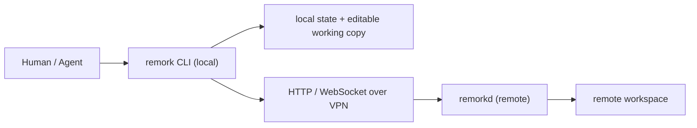

# Remork

Remork 是一个“本地控制远端工作区”的工具原型。目标是让人和 Agent 都可以在本机查看、同步、编辑远端服务器上的项目，并通过一个轻量远端 daemon 执行命令或打开交互式 shell。

它解决的核心问题是：远端服务器很多，但不一定能在每台机器上安装完整 Agent 环境、同步依赖或联网构建。Remork 的远端只需要一个预编译好的 `remorkd` 单文件 daemon。

## 当前状态

这个仓库现在是 MVP 基础层，不是完整终端产品。

已经实现并测试通过：

- `remorkd` 远端 daemon
- manifest 扫描和大文件识别
- 文件下载和 HTTP range 下载
- 显式 `apply` 回写，带 base hash 冲突校验
- 远端非交互式 `exec`
- WebSocket 文件事件 `/events`
- WebSocket PTY shell `/shell`
- 本地 state、planner、transfer、progress、config、client 内部包
- Linux arm64/amd64、Darwin arm64/amd64 release 构建

还没有完成：

- `remork sync`
- `remork pull`
- `remork apply`
- `remork exec`
- `remork shell`
- `remork diff`
- `remork host/workspace` 配置命令

现在的 `remork` CLI 只有 `version` 和 `status` skeleton。当前主要使用方式是直接运行 `remorkd` 并调用 HTTP/WebSocket API，或基于 `internal/client` 继续开发 CLI。

当前 CLI 可用行为：

```bash
dist/remork version
dist/remork status host:/absolute/workspace
```

`status` 目前只会回显 workspace 参数，是占位命令，不会连接 daemon。

## 核心模型



关键约束：

- 远端工作区是 source of truth。
- 本地目录是 editable working copy，不是只读镜像。
- 本地改动不会自动写回远端，必须显式 `apply`。
- `apply` 必须带 base hash，远端文件变过就拒绝，避免覆盖别人或命令产生的新改动。
- 大文件默认不拉全量内容，只在本地生成 `原文件名.meta`。
- Remork 不依赖目标项目自己的 `.git`，也会跳过 `.git` 和 `.remork` 目录。
- 当前安全模型假设机器只能通过 VPN 访问，不要把 daemon 暴露到公网。

默认大文件阈值是 `128MB`。大于阈值的文件会变成本地 meta 占位文件，例如：

```text
remote: /workspace/checkpoints/model.tar.gz
local:  /mirror/checkpoints/model.tar.gz.meta
```

## 构建

需要本机有 Go 1.22+。远端机器不需要 Go。

```bash
go test ./...
scripts/build-release.sh dev
```

构建产物在 `dist/`：

```text
dist/remork
dist/remorkd-linux-amd64
dist/remorkd-linux-arm64
dist/remorkd-darwin-amd64
dist/remorkd-darwin-arm64
dist/remorkd.example.toml
dist/checksums.txt
```

验证本机平台 daemon：

```bash
dist/remorkd-$(go env GOOS)-$(go env GOARCH) --version
```

## 启动 daemon

本地测试：

```bash
tmp_remote=$(mktemp -d)
printf 'hello\n' > "$tmp_remote/a.txt"

dist/remorkd-$(go env GOOS)-$(go env GOARCH) \
  --root "$tmp_remote" \
  --addr 127.0.0.1:7731
```

远端离线部署示例，以 Linux arm64 为例：

```bash
scripts/build-release.sh dev
scp dist/remorkd-linux-arm64 host:/tmp/remorkd
ssh host 'chmod +x /tmp/remorkd && /tmp/remorkd --version'
ssh host 'nohup /tmp/remorkd --root /path/to/workspace --addr 0.0.0.0:17731 </dev/null >/tmp/remorkd.log 2>&1 & echo $! >/tmp/remorkd.pid'
```

如果本机有 HTTP proxy，直连 VPN IP 验证时建议加 `--noproxy '*'`，否则请求可能被代理截获：

```bash
curl --noproxy '*' -fsS \
  'http://REMOTE_VPN_IP:17731/manifest?root=/path/to/workspace&path=.&recursive=true'
```

清理远端测试 daemon：

```bash
ssh host 'if [ -f /tmp/remorkd.pid ]; then kill "$(cat /tmp/remorkd.pid)" 2>/dev/null || true; fi; rm -f /tmp/remorkd.pid /tmp/remorkd.log /tmp/remorkd'
```

如果你按 smoke test 创建了 `/tmp/remork-e2e`，也一起清理：

```bash
ssh host 'rm -rf /tmp/remork-e2e'
```

## API 快速试用

下面假设 daemon 地址是：

```bash
export REMORKD=http://127.0.0.1:7731
export ROOT=/path/to/workspace
```

`ROOT` 必须和 `remorkd --root` 传入的路径完全一致。当前 daemon 做 exact allowlist match，不会把 `/path/to/workspace/..`、symlink 后路径或不同写法当成同一个 root。

如果 `REMORKD` 是远端 VPN IP，并且本机有 HTTP proxy，下面所有 `curl` 都建议加：

```bash
--noproxy '*'
```

### 读取 manifest

```bash
curl -fsS "$REMORKD/manifest?root=$ROOT&path=.&recursive=true"
```

返回每个文件的 path、type、size、mtime、revision、hash 和 large 标记。小文件会有 `sha256:<hex>` hash，大文件 hash 可为空。

### 下载文件

```bash
curl -fsS "$REMORKD/download?root=$ROOT&path=src/main.go" -o main.go
```

Range 下载：

```bash
curl -fsS \
  -H 'Range: bytes=0-1023' \
  "$REMORKD/download?root=$ROOT&path=large.bin" \
  -o large.bin.part
```

### 显式 apply

先把远端当前 base 下载到文件，再对这个文件计算 base hash。不要把 `curl` 输出放进 shell 变量后再 hash；shell 变量容易丢掉末尾换行，导致 hash 不一致。

```bash
curl -fsS "$REMORKD/download?root=$ROOT&path=a.txt" -o /tmp/remork-base-a.txt
base_hash="sha256:$(shasum -a 256 /tmp/remork-base-a.txt | awk '{print $1}')"
```

然后发 changeset：

```bash
printf 'after\n' > /tmp/remork-new-a.txt
content_b64="$(base64 < /tmp/remork-new-a.txt | tr -d '\n')"

cat > /tmp/remork-apply.json <<EOF
{
  "changes": [
    {
      "path": "a.txt",
      "kind": "update",
      "base_hash": "$base_hash",
      "content": "$content_b64"
    }
  ]
}
EOF

curl -fsS \
  -X POST \
  -H 'Content-Type: application/json' \
  --data @/tmp/remork-apply.json \
  "$REMORKD/apply?root=$ROOT"
```

注意：`content` 是 JSON 的 `[]byte` 字段，Go 的 JSON 编码会用 base64。上面 `YWZ0ZXIK` 是 `after\n`。

支持的 change kind：

```text
create
update
delete
```

如果 base hash 不匹配，daemon 返回 conflict，不会部分写入 changeset。

当前 HTTP 状态码语义：

```text
200  apply 成功
400  changeset 非法，例如 path 逃逸或未知 kind
409  base hash 冲突或 create/delete/update 语义冲突
```

### 执行远端命令

```bash
curl -fsS \
  -X POST \
  -H 'Content-Type: application/json' \
  --data '{"root":"'"$ROOT"'","cwd":"'"$ROOT"'","command":["sh","-c","pwd && ls"]}' \
  "$REMORKD/exec"
```

返回：

```json
{
  "stdout": "...",
  "stderr": "...",
  "exit_code": 0,
  "timed_out": false
}
```

`cwd` 必须在允许的 root 内。命令超时时会被 kill，并返回 `timed_out=true`。

### 文件事件

`/events` 是 WebSocket endpoint：

```text
ws://HOST:PORT/events?root=/path/to/workspace
```

事件包含：

```json
{
  "kind": "create|update|delete|rename|overflow",
  "path": "relative/path",
  "revision": "..."
}
```

如果收到 `overflow` 或 `resync_required=true`，客户端应该重新拉 manifest。watch/events 只是加速路径，正确性仍以 manifest reconciliation 为准。

### 交互式 shell

`/shell` 是 WebSocket endpoint：

```text
ws://HOST:PORT/shell?root=/path/to/workspace
```

当前实现会在 root 目录下启动 `sh` PTY。WebSocket 客户端向连接写入 bytes，daemon 会把 shell 输出写回 WebSocket。

`/events` 和 `/shell` 不能用普通 `curl` 验证。当前仓库用 Go 测试覆盖了这两个 endpoint。如果本机有 `websocat`，可以手动试：

```bash
export WS=ws://127.0.0.1:7731

# 终端 1：监听事件
websocat "$WS/events?root=$ROOT"

# 终端 2：触发事件
touch "$ROOT/watched.txt"
```

shell：

```bash
websocat -t "$WS/shell?root=$ROOT"
```

当前 shell 是 MVP 级别：固定启动 `sh`，默认 `24x80`，还没有 resize 协议、detach/attach UX 或结构化错误帧。

## 可复制的本地 smoke test

下面这段会在本机创建临时 workspace，启动 daemon，验证 manifest、download、apply、exec，然后清理：

```bash
set -euo pipefail

scripts/build-release.sh dev
daemon="dist/remorkd-$(go env GOOS)-$(go env GOARCH)"
root="$(mktemp -d)"
printf 'hello\n' > "$root/a.txt"

"$daemon" --root "$root" --addr 127.0.0.1:7731 >/tmp/remorkd-local.log 2>&1 &
pid=$!
trap 'kill "$pid" 2>/dev/null || true; rm -rf "$root" /tmp/remorkd-local.log /tmp/remork-apply.json /tmp/remork-base-a.txt /tmp/remork-new-a.txt' EXIT
sleep 1

REMORKD=http://127.0.0.1:7731
ROOT="$root"

curl -fsS "$REMORKD/manifest?root=$ROOT&path=.&recursive=true" >/tmp/remork-manifest.json
curl -fsS "$REMORKD/download?root=$ROOT&path=a.txt" -o /tmp/remork-base-a.txt
base_hash="sha256:$(shasum -a 256 /tmp/remork-base-a.txt | awk '{print $1}')"

printf 'after\n' > /tmp/remork-new-a.txt
content_b64="$(base64 < /tmp/remork-new-a.txt | tr -d '\n')"
cat > /tmp/remork-apply.json <<EOF
{"changes":[{"path":"a.txt","kind":"update","base_hash":"$base_hash","content":"$content_b64"}]}
EOF

curl -fsS -X POST -H 'Content-Type: application/json' --data @/tmp/remork-apply.json "$REMORKD/apply?root=$ROOT"
curl -fsS -X POST -H 'Content-Type: application/json' --data '{"root":"'"$ROOT"'","cwd":"'"$ROOT"'","command":["sh","-c","cat a.txt"]}' "$REMORKD/exec"
```

远端 smoke test 形状类似，只是把 `dist/remorkd-linux-arm64` 复制到远端、用 `0.0.0.0:17731` 启动，并从本机直连时使用 `curl --noproxy '*'`。

## 代码结构

```text
cmd/remork/          local CLI skeleton
cmd/remorkd/         remote daemon entrypoint
internal/api/        shared wire structs
internal/paths/      path normalization and workspace escape checks
internal/manifest/   filesystem manifest scanner and large-file metadata
internal/state/      local base snapshot and dirty detection
internal/planner/    sync/pull/delete/conflict planning
internal/transfer/   local file and .meta materialization
internal/apply/      changeset apply with base verification
internal/daemon/     HTTP/WebSocket daemon routes
internal/client/     HTTP client used by future CLI
internal/exec/       non-interactive command runner
internal/pty/        PTY session manager
internal/watch/      fsnotify event normalization
test/e2e/            end-to-end daemon/client workflow tests
```

## 测试

常规测试：

```bash
go test ./...
```

重复跑 e2e：

```bash
go test ./test/e2e -count=5 -run Test -v
```

race detector：

```bash
go test -race ./internal/daemon ./internal/client ./internal/state ./internal/watch ./test/e2e
```

当前覆盖的关键 edge cases：

- `../escape`、绝对路径、encoded traversal
- symlink 逃逸
- root allowlist
- `.git` / `.remork` 跳过
- 大文件阈值边界
- local dirty 不被 sync 覆盖
- remote delete 与 dirty conflict
- apply create/update/delete conflict
- changeset 原子性
- apply retry 不重复危险写入
- range download
- quiet progress
- exec timeout 和 cwd escape
- PTY lifecycle
- watch overflow/delete

## 真实远端验证记录

已经验证过两个 Linux arm64 远端：

```text
z00879328_docker       root@175.100.2.7:22022
z00879328_docker_2.6   root@175.100.2.6:2226
```

验证方式：

- 本地构建 `dist/remorkd-linux-arm64`
- `scp` 到远端 `/tmp/remorkd`
- 远端只执行二进制，不安装 Go、不跑包管理器、不需要联网
- 远端 localhost manifest curl 通过
- 本机通过 VPN IP + `curl --noproxy '*'` 直连 manifest 通过
- `/tmp/remorkd*` 和 `/tmp/remork-e2e` 已清理

## 下一步开发建议

最自然的下一步是把当前内部能力接成真正的 CLI：

1. `remork host add`
2. `remork workspace add`
3. `remork sync`
4. `remork pull`
5. `remork diff`
6. `remork apply`
7. `remork exec`
8. `remork shell`
9. `remork watch`

实现 CLI 时应继续复用现有包，不要重新写一套逻辑：

- sync/pull 决策走 `internal/planner`
- 下载和 meta 落盘走 `internal/transfer`
- dirty 检测走 `internal/state`
- HTTP 调用走 `internal/client`
- 远端正确性以 `internal/daemon` + manifest/apply 校验为准
