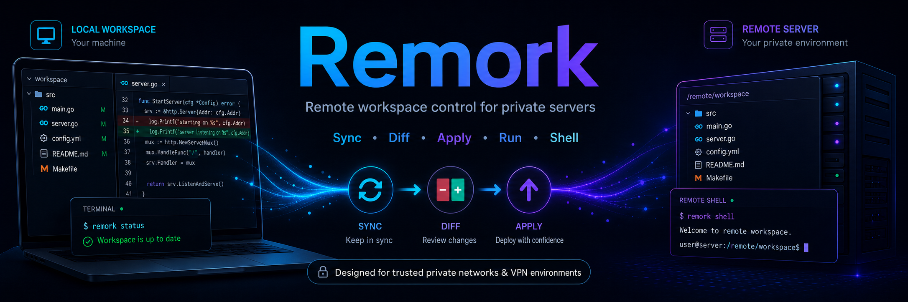

<p align="center">
  
</p>

# Remork

Remote workspace control for private servers.

[中文文档](README_ZH.md)

Remork lets you edit a remote server directory from a local working copy. You
sync files down, edit locally, review changes, and explicitly apply them back.
Commands and interactive shells still run on the remote machine.

Use it for trusted VPN or private-network servers where installing a full agent
runtime on every machine is inconvenient.

## Install

Install the macOS client:

```bash
VERSION=v0.1.1.beta03
case "$(uname -m)" in
  arm64) CLIENT_PLATFORM=darwin-arm64 ;;
  x86_64) CLIENT_PLATFORM=darwin-amd64 ;;
  *) echo "unsupported macOS architecture: $(uname -m)" >&2; exit 1 ;;
esac

mkdir -p "$HOME/.local/bin"
curl -L -o "$HOME/.local/bin/remork" \
  "https://github.com/zhangtao0408/Remork/releases/download/${VERSION}/remork-${CLIENT_PLATFORM}"
chmod 0755 "$HOME/.local/bin/remork"
export PATH="$HOME/.local/bin:$PATH"

remork version
```

If a new terminal cannot find `remork`, add this to your shell profile:

```bash
export PATH="$HOME/.local/bin:$PATH"
```

Install the Windows client with PowerShell:

```powershell
$Version = "v0.1.1.beta03"
$Arch = if ([System.Runtime.InteropServices.RuntimeInformation]::OSArchitecture -eq "Arm64") { "arm64" } else { "amd64" }
$InstallDir = Join-Path $HOME ".local\bin"
New-Item -ItemType Directory -Force $InstallDir | Out-Null
Invoke-WebRequest -Uri "https://github.com/zhangtao0408/Remork/releases/download/$Version/remork-windows-$Arch.exe" -OutFile (Join-Path $InstallDir "remork.exe")
$env:Path = "$InstallDir;$env:Path"

remork version
```

If a new PowerShell cannot find `remork`, add `%USERPROFILE%\.local\bin` to
your user `Path`.

## Set Up

For normal use, start here:

```bash
remork setup
```

`setup` is the product flow. It can prepare or update a server, repair an
existing setup, or bind a local directory to a remote workspace. It shows a
review plan before changing daemon, host, or workspace state.

You usually only need to know:

- **SSH target**: how Remork copies or updates `remorkd`, for example
  `user@server`.
- **Allowed root**: the remote base directory the daemon may serve, for example
  `/home/me`.
- **Workspace root**: the specific remote project, for example
  `/home/me/project`.
- **Daemon URL**: the HTTP URL the local client uses after setup.

If your daemon URL is a private IP and your shell has proxy variables set, say
yes to **Bypass proxy** during setup.

## Daily Use

From the local working copy:

```bash
remork sync

# edit files locally

remork status
remork diff
remork apply
```

Run commands on the remote workspace:

```bash
remork run -- pwd
remork run "pytest -q"
remork run --timeout 30s "go test ./..."
```

`remork run` loads the remote user's bash environment before running the
command, so variables from `~/.bashrc` are available. Output is replayed after
the command completes.

Open an interactive remote shell:

```bash
remork shell
```

Use `run` for scripts and agents. Use `shell` when a human needs an interactive
terminal.

## Common Commands

| Command | Purpose |
| --- | --- |
| `remork setup` | Guided setup for server, host, and workspace. |
| `remork sync` | Pull remote files into the local working copy. |
| `remork status` | Show local edits, remote updates, conflicts, and large-file placeholders. |
| `remork diff` | Review local edits against the last synced base. |
| `remork apply` | Write reviewed local edits back to the remote workspace. |
| `remork pull PATH` | Download a specific file or directory. |
| `remork run -- COMMAND` | Run a non-interactive command remotely. |
| `remork shell` | Open an interactive remote shell. |
| `remork doctor` | Check local and remote readiness. |

Run `remork` with no subcommand in a real terminal to open the command menu.

## Large Files

Large remote files are represented locally as `.meta` placeholders. Download a
full file only when needed:

```bash
remork pull checkpoints/model.tar.gz
```

For non-interactive scripts, confirm the large download explicitly:

```bash
remork pull --force checkpoints/model.tar.gz
```

## Safety Rules

- The remote workspace is the source of truth.
- Local edits are never applied automatically.
- `remork apply` checks the synced base before writing, so newer remote changes
  are not overwritten silently.
- New untracked files are skipped unless you opt in:

```bash
remork apply path/to/new-file --include-untracked
```

Use `.remorkignore` for caches, secrets, virtual environments, generated
outputs, and agent scratch files that should never be applied.

## Scriptable Setup

Use the advanced commands when you need automation instead of the guided setup:

```bash
remork daemon install my-lab \
  --ssh user@server \
  --url http://server:17731 \
  --root /home/me \
  --token-file .remork/remork.token \
  --token-env REMORK_TOKEN \
  --no-proxy \
  -y \
  --verify

remork init my-lab:/home/me/project --non-interactive
remork sync --non-interactive
```

Use token auth on shared VPNs or multi-user networks. On a trusted private
network you can choose an unauthenticated daemon, but non-loopback installs
require the explicit `--allow-unauthenticated-network-bind` flag.

For machine-readable output, use command-specific flags such as `--json`,
`--quiet`, `--yes`, and the global `--non-interactive` flag where supported.
`--color=never` only disables ANSI color; it does not make human text output
machine-parseable.

## Troubleshooting

```bash
remork doctor
remork host list
remork daemon status HOST
remork workspace
```

Common fixes:

- **Connection refused**: the daemon URL is saved, but no daemon is listening
  there. Run `remork setup` and choose repair or update.
- **HTTP 502 with a private IP**: your shell proxy is probably intercepting the
  daemon URL. Enable `--no-proxy` for that host or choose **Bypass proxy** in
  setup.
- **Remote root is not advertised**: restart or update the daemon with an
  allowed root that contains the workspace.
- **Token env is not set**: load the token variable configured for the host,
  for example `export REMORK_TOKEN="$(cat ~/.remork/remork.token)"`.
- **Only a `.meta` file was synced**: the remote file is large; use
  `remork pull --force PATH` when you really need the content locally.

Every command has focused help:

```bash
remork setup -h
remork run -h
remork daemon install -h
```

## Development

```bash
go test ./...
go vet ./...
scripts/build-release.sh v0.1.1.beta03
```

## More Documentation

- [中文 README](README_ZH.md)
- [Daemon API](docs/remork-api.md)
- [Agent operating guide](skills/remork/SKILL.md)
- [Product V1 validation notes](docs/remork-product-v1-validation.md)
